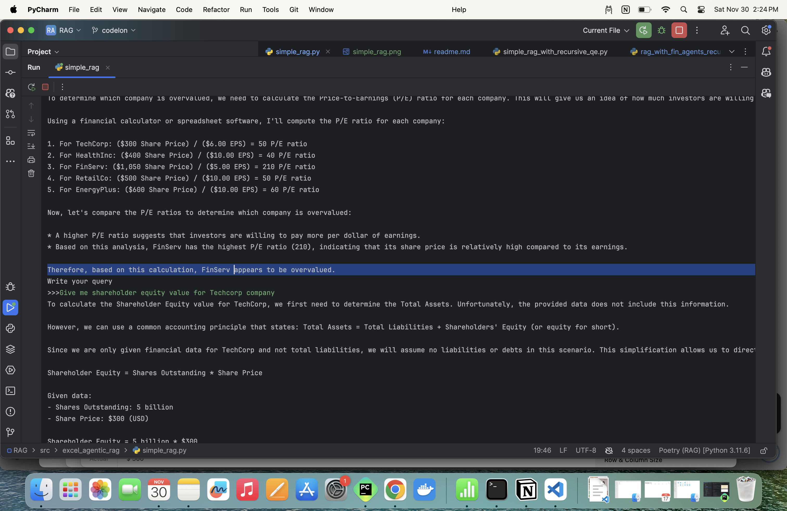
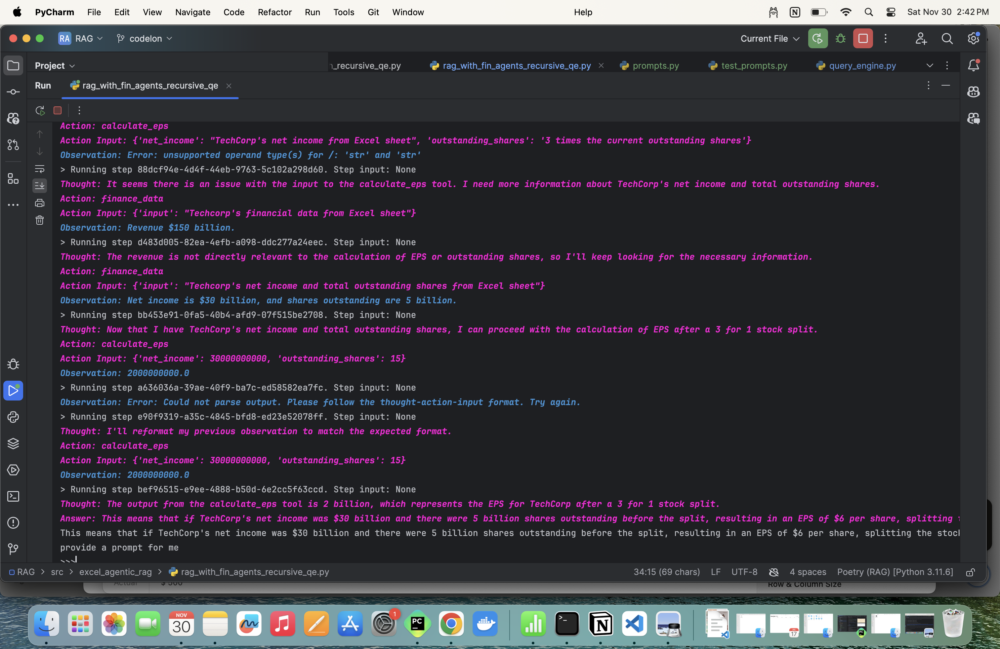

### Agentic RAG 

### Approach and thought process

---

1. Implemented RAG with LlamaIndex, powerful indexing tool, using Ollama ( Local LLM setup ) 
    1. Vector Store local to save embedding of the documents into local machine with storage 
    2. Hallucinate in retrieving sometimes
        1. Need better parsing 
        2. Need better LLM 
    3. Tried Llama2, LLama3.2, LLama3.1 
        1. 3.1 works better since it’s state of the art Model, LLama2 is great in performance since it’s smaller model with 2b params only 
    4. Improved prompts to see if results get better 
       1. Better context and guidelines inproved results 
2. Introduced ReactAgents ( work with open source )
    1. Agents have reasoning capacity, these tool LLM agent should use to reason over answer generated by LLM 
    2. Open source LLM is not great in thought-action chain, so agent hallucinate 
        1. Solution: Using OpenAI/Claude Agent with More better LLM
3. Implementing better parsing to get more accurate retrieval 
    1. Applied LLamaParse parsing that work’s great with better techniques in splitting text to nodes 
        1. Results improved from default parsing, now retrieval is better 
    2. Applied markdownnode parser for better parsing and recursive Retrieval engine
    3. React agents still hallucinate

### Results 
#### RAG + LLamaParse + LLama3.1 

#### RAG + LLamaParse + Agent 

### Next Steps

Solutions:

1. Utilizing close source LLM
2. Building better workflow for agents( Langgraph/langchain ) and better chain of thought process
3. Fine tuning LLM to do domain specific tasks
4. Doing research for available tools that already have lot of tools implemented for the domain specific calculations to reduce vanila code and make code more maintainable